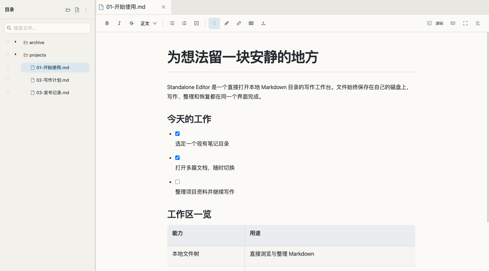
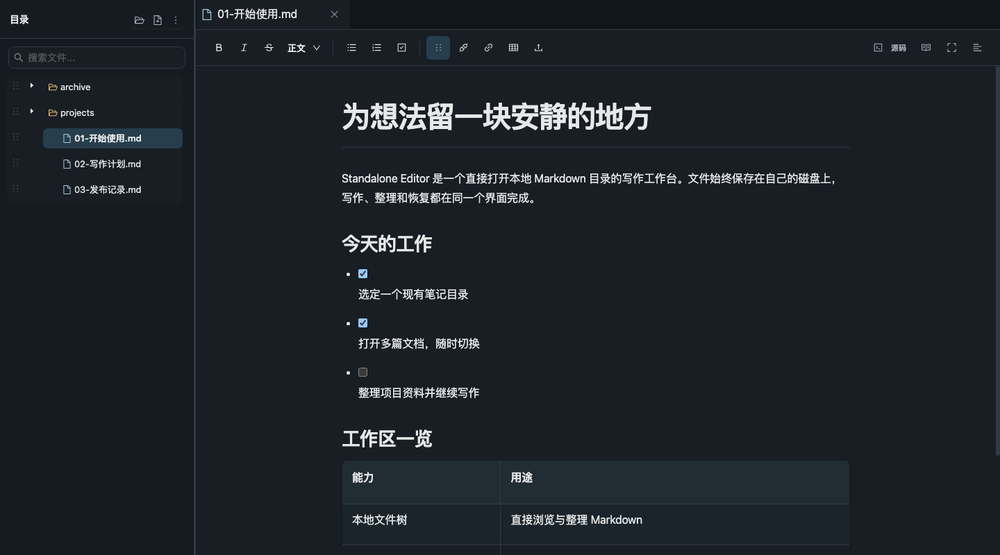

# Standalone Editor

**打开一个本地目录，安静地写 Markdown。**

Standalone Editor 是一款在浏览器中运行的本地文档工作台。它直接读写你选择的文件夹：左边整理文件，中间专注写作，保存状态和恢复入口始终可见。文档仍是普通的 `.md` 文件，不需要导入专有格式。

*真实界面截图，内容来自隔离的演示工作区。* [查看深色主题截图](docs/images/workbench-dark.png)

## 一眼了解

| 写作 | 整理 | 找回 |
| --- | --- | --- |
| 富文本与源码两种模式、多标签、任务列表、基础表格 | 本地文件树、搜索、新建、重命名、移动、ZIP 导入 | 三秒自动保存、保存冲突提示、版本历史、回收站与浏览器草稿 |

项目面向**个人、本机、已有 Markdown 目录**的使用场景。图片可以使用相对于文档的路径；编辑器只在显示时把它映射为本地媒体地址，磁盘上的 Markdown 不依赖应用的 API URL。

## 快速开始

建议使用 Node.js 22（与 CI 环境一致）和 npm。macOS / Linux 可在终端运行：

~~~bash
git clone https://github.com/nerkeler/standalone-editor.git
cd standalone-editor
(cd backend && npm ci)
(cd frontend && npm ci)
bash start.sh "$HOME/Documents/notes"
~~~

打开 **http://127.0.0.1:5558/**。`start.sh` 会启动前后端，并在退出时停止它们。也可以省略最后的目录参数，使用之前保存的工作区；首次运行会创建默认目录。

Windows 可在两个 PowerShell 窗口分别启动：

~~~powershell
# 窗口一：进入仓库后
cd backend
npm ci
node src/index.js --workspace "C:\Users\you\Documents\notes"

# 窗口二：从仓库根目录进入
cd frontend
npm ci
npm run dev
~~~

目录选择器会使用**运行后端的系统**的真实路径规则，支持 macOS、Linux 和 Windows 的盘符与 UNC 路径。界面记住已选择的目录；上次使用的磁盘暂时不可用时，会明确提示，不会悄悄切换到另一个目录。

## 从打开文件到安全保存

1. **选择目录。** 使用界面中的目录按钮打开已有笔记文件夹；左侧文件树可以搜索、展开和整理文件。
2. **开始写作。** 点击 `.md` 或 `.markdown` 文件，在标签页间切换。常见标题、列表、任务、链接、引用、代码块和基础表格可在富文本模式编辑。
3. **看保存状态。** 停止编辑约三秒后自动保存；底部显示待保存、保存中、已保存或失败。也可以手动保存。
4. **需要时找回。** 文件内容发生外部修改时，编辑器会阻止旧版本直接覆盖新版本，并展示冲突处理；版本历史、回收站和本地草稿分别提供恢复途径。

### 复杂 Markdown 原样保留

YAML front matter、WikiLinks、脚注、引用式链接、带对齐的表格等语法会默认进入**源码模式**。这是为了避免富文本转换改写原有结构；主动切换到富文本前会显示风险提示。当前源码模式尚未提供逐段波浪线标注或自动修正，相关改进见[下一轮实施计划](docs/next-cycle-editor-productization.md)。

只有有效 UTF-8 的普通 `.md` / `.markdown` 文件可以进入编辑器。图片进入预览器；其他普通附件保留在文件树，可下载原始字节，不会被误当作 Markdown 保存。

## 目录仍然属于你

~~~text
my-notes/
├── 开始使用.md
├── projects/
│   ├── 网站改版.md
│   └── assets/
│       └── workflow.svg
└── archive/
    └── 2026-09.md
~~~

Markdown 中的 `` 相对于所在文档解析。工作区本身无需数据库才能阅读。版本历史与回收站默认放在工作区外的 `~/.standalone-editor/recovery`，防止恢复数据混入笔记目录；删除项目会先进入回收站。

~~~mermaid
flowchart LR
  B["浏览器工作台 React · TipTap"] -->|"本机 HTTP"| S["本地服务 Node.js · Express"]
  S --> W["你选择的 Markdown 目录"]
  S --> R["工作区外的历史与回收站"]
~~~

<strong>查看深色主题</strong>

## 运行边界

- 后端默认只监听 `127.0.0.1`。应用没有账号认证，也不提供云端同步；当前定位是单机使用。
- 工作区文件操作会检查路径边界和文件类型。保存使用文件 revision 检测冲突，并保留可恢复的历史版本。
- 当前表格插入为固定 3×3；可选行列、表格内增删行列，以及图片尺寸和对齐控制列在[下一轮计划](docs/next-cycle-editor-productization.md)，不要将其视为已上线功能。
- 图片显示支持相对路径；现有上传流程写入工作区根目录的 `assets/`。桌面工具栏的图片上传按钮目前存在无响应问题；修复按钮并改为当前文档同级 `assets/` 已列入下一轮计划。

## 开发与参考

| 位置 | 内容 |
| --- | --- |
| `frontend/` | React、Vite、TipTap 工作台 |
| `backend/` | Express、工作区校验、文件读写与恢复 |
| [技术参考](docs/reference.md) | API、ZIP 导入限制、恢复规则、环境变量与跨平台目录选择 |
| [产品方向](PRODUCT.md) · [视觉方向](DESIGN.md) | 设计原则与界面约定 |

运行现有检查：

~~~bash
(cd backend && npm test)
(cd frontend && npm run test:unit && npm run build && npm run test:browser)
~~~

浏览器回归测试需要 Chrome 或 Chromium；本地未能自动找到时，可通过 `CHROME_PATH` 指定浏览器可执行文件。CI 在 Ubuntu 和 Windows 运行后端测试，在 Ubuntu 运行前端单元测试、构建与浏览器测试。
