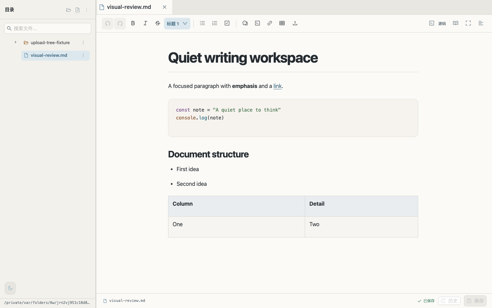
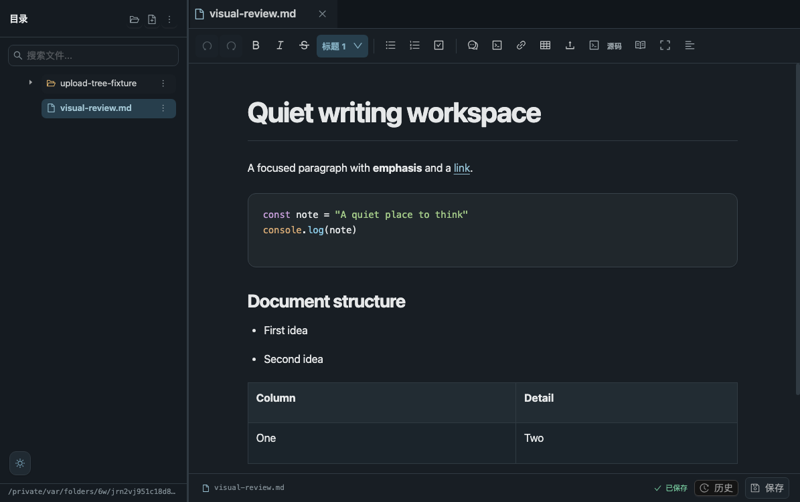
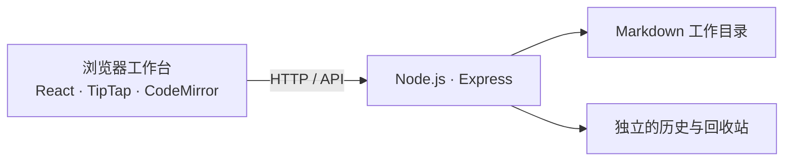

# Standalone Editor

**以普通 Markdown 文件为基础的本地文档工作台。**

Standalone Editor 提供浏览器中的 Markdown 编辑、目录管理与内容恢复能力，直接读写指定工作目录。它面向个人笔记、项目文档和本地知识库，支持富文本与源码编辑，保留文件目录结构和相对图片路径，无需将文档迁入专有格式或数据库。

[](https://github.com/nerkeler/standalone-editor/actions/workflows/ci.yml)

[安装运行](#安装运行) · [使用说明](#使用说明) · [部署与数据边界](#部署与数据边界) · [技术文档](#技术文档) · [开发与验证](#开发与验证)



*当前界面的真实截图，使用隔离的演示工作区。*

## 核心能力

| 能力 | 说明 |
| --- | --- |
| 双模式编辑 | 富文本用于常见 Markdown 结构；CodeMirror 源码模式保留复杂语法，并对无法无损转换的片段提供定位与解释。 |
| 写作工作台 | 多文档标签、标题大纲、全文搜索、浅色与深色主题、专注模式，以及支持快捷键的原生撤销与重做。 |
| 本地目录管理 | 浏览或直接输入工作目录；新建、重命名、移动、删除文件及目录，导入 ZIP，下载文档与附件。 |
| 表格与图片 | 插表时选择行列；通过对象菜单增删行列、删除整表，或调整图片宽度与左/中对齐。图片上传到文档同级 `assets/`。 |
| 保存与冲突处理 | 三秒防抖自动保存、手动保存、明确的保存状态，以及基于文件内容 revision 的版本冲突检测与比较流程。 |
| 内容恢复 | 文件历史、回收站、已删除文件的历史管理、浏览器草稿恢复，以及恢复数据统计和中断操作检查。 |
| 独立运行 | 正式构建由一个 Node.js 进程提供页面与 API；运行时不依赖外部字体或 CDN，可用于离线写作。 |

<details>
<summary>查看深色主题</summary>



</details>

## 安装运行

运行环境为 **Node.js `>=22.17.0 <23.0.0` 与 npm**。项目在 macOS、Linux 和 Windows 上运行；`start.sh` 启动器适用于 macOS / Linux，Windows 使用 Node.js 直接启动后端。

### 正式运行（推荐）

在 macOS / Linux 上克隆仓库、安装依赖并构建前端：

```bash
git clone https://github.com/nerkeler/standalone-editor.git
cd standalone-editor
(cd frontend && npm ci && npm run build)
(cd backend && npm ci --omit=dev)
EDITOR_MODE=production bash start.sh "$HOME/Documents/notes"
```

打开 **[http://127.0.0.1:5557/](http://127.0.0.1:5557/)**。正式模式由后端直接提供 `frontend/dist`，无需单独运行 Vite。

目录参数用于指定工作区，不存在时会创建。省略参数则使用已保存的工作区，首次运行创建默认笔记目录。已保存的目录不可访问时，界面会显示原因并提供重新选择入口。

<details>
<summary>Windows / PowerShell</summary>

从仓库根目录执行：

```powershell
cd frontend
npm ci
npm run build
cd ..\backend
npm ci --omit=dev
node src\index.js --workspace "C:\Users\you\Documents\notes"
```

将示例路径替换为实际存在的笔记目录。打开 `http://127.0.0.1:5557/`，使用 `Ctrl+C` 停止服务。

</details>

### 开发模式

开发模式分别运行 Vite 和后端，默认页面地址为 **[http://127.0.0.1:5558/](http://127.0.0.1:5558/)**：

```bash
(cd backend && npm ci)
(cd frontend && npm ci)
bash start.sh "$HOME/Documents/notes"
```

Windows 开发环境可在两个终端分别运行 `backend` 中的 `npm run dev` 和 `frontend` 中的 `npm run dev`。

长期运行、服务监督、更新与回退说明见 [运行指南](docs/release-runtime.md)。

## 使用说明

### 选择工作目录

欢迎页和工作台共用目录选择器。顶部地址栏显示当前浏览的完整路径：可粘贴路径后按 Enter，也可点击文件夹逐层进入，使用“上一级”返回。快捷位置仅用于浏览；点击 **“使用此目录”** 才确认工作区。

路径属于**运行后端的机器**。本机启动时是本机目录；在其他主机部署时，是该主机的目录。目录访问和文件写入遵循后端系统账号权限，也可配置允许访问的目录范围。

目录验证期间不能确认选择。慢请求保留上次成功的列表并标明所属路径；失败时提供错误说明与重试。切换工作区前会保存当前草稿，保存失败或发生冲突时保留原工作区。取消选择返回原文档。

### 编辑与 Markdown 保真

有效 UTF-8、大小不超过 5 MiB 的普通 `.md` / `.markdown` 文件可编辑。图片使用预览器，其他普通附件保留在目录中并可下载原始字节；超出编辑大小限制的文档使用只读或下载方式访问。

富文本支持常见标题、段落、列表、纯无序任务列表、链接、引用、代码块和基础表格。YAML 元数据、WikiLinks、脚注及其他超出保真范围的结构使用源码模式；混合普通项与任务项的列表、有序任务列表也会受到保护。

`file://`、`obsidian://` 等不受富文本安全规则支持的链接使用源码模式，保留完整目标地址，不执行外部协议。源码编辑保留统一的 LF 或 CRLF 换行；混用多种换行的文件在编辑后仍会统一为 LF。

源码模式以波浪下划线标出具体片段，悬停显示原因，`F8` 跳转到下一处。经验证可保留的普通转义在编辑器内部处理，无需用户反复确认。对于需要改写源码的安全转换，打开时提供变更预览，点击 **“确认修复并保存”** 后才写入文件，仍执行 revision 校验。仅打开文件或取消建议不会修改磁盘内容。

### 表格与图片操作

- **表格：** 插入时通过网格或数字输入选择行列，最多 20 行、12 列；右键单元格可增删行列或删除整表。暂不支持富文本合并单元格。
- **图片：** 上传或粘贴后保存到当前文档同级 `assets/`，文件树自动刷新并展开该目录。右键图片可调整宽度、左对齐或居中，也可删除文档中的图片引用；删除引用不删除 `assets/` 中的文件。角柄支持拖动缩放。
- **菜单入口：** 桌面使用右键，选中对象后也可按 `Shift+F10`；移动端使用对象旁的“更多”按钮。`Esc` 关闭菜单并返回编辑。

图片路径保留为标准 Markdown 相对引用。显示属性使用紧邻图片的元数据注释保存；其他 Markdown 工具仍可读取图片引用，是否应用这些显示属性取决于其支持能力。

```text
notes/
└── projects/
    ├── plan.md
    └── assets/
        └── diagram.png
```

```markdown
<!-- se-image:width=75;align=center -->
```

### 撤销、重做与保存

| 操作 | macOS | Windows / Linux |
| --- | --- | --- |
| 撤销 | `⌘+Z` | `Ctrl+Z` |
| 重做 | `⌘+Shift+Z` 或 `Ctrl+Y` | `Ctrl+Shift+Z` 或 `Ctrl+Y` |

工具栏同时提供撤销与重做。富文本使用 TipTap / ProseMirror 原生历史，源码使用 CodeMirror 原生历史。普通保存、自动保存及确认冲突后保存本地草稿会保留当前编辑记录；切换文件或编辑模式、重新加载磁盘内容、恢复历史版本时开启新会话。

停止编辑约三秒后自动保存，也可使用底部保存按钮。保存状态区分待保存、保存中、成功、失败和冲突。磁盘内容与读取版本不一致时，编辑器阻止直接保存，提供磁盘版本与本地草稿的比较和选择。

### 恢复与存储管理

版本历史与回收站默认存放在工作区外的 `~/.standalone-editor/recovery`。成功替换文档后，历史保留策略以最近 50 个被替换版本为目标；清理失败时保留额外记录，文档仍显示已保存，服务日志和恢复检查结果报告清理问题。

删除操作先移入回收站。回收站项目记录 30 天到期时间，**不会自动永久删除**；清理过期项目需要用户确认。已删除文件的历史单独保留，永久删除回收站副本不会连带删除这些历史。

跨卷移入回收站会记录中断状态。启动、重新选择工作区或手动检查时，原位置空闲且身份与内容核验一致的项目会恢复到原路径，完整回收站副本继续保留。路径占用、内容变化或无法核验时保留数据并说明原因。

浏览器草稿提供异常退出后的恢复入口，依赖当前浏览器的站点存储。恢复机制不能替代独立备份；详细规则见 [技术参考](docs/reference.md)。

## 部署与数据边界

默认监听 `127.0.0.1`，适用于个人本机或由使用者管理访问边界的可信网络。**当前没有登录认证**，认证方案保留在 [维护 TODO](docs/maintenance-todo.md)；可访问服务的客户端具有应用操作权限。不要将当前版本作为公网或多用户服务部署。

一个后端实例共享一个工作区，浏览器窗口之间不能独立选择不同工作区。工作区标识和文件 revision 用于状态一致性，不是认证凭据。恢复目录必须位于工作区外，路径选择会提前校验此约束。

| 配置 | 用途 |
| --- | --- |
| `EDITOR_MODE` | 启动器模式：`production` 或默认的 `development`。 |
| `EDITOR_HOST` / `EDITOR_PORT` | `start.sh` 的监听地址与后端端口，默认 `127.0.0.1:5557`；直接启动 Node 时使用 `HOST` / `PORT`。 |
| `EDITOR_RECOVERY_DIR` | 历史版本与回收站的存储位置。 |
| `EDITOR_DIRECTORY_ROOTS` | 可选目录范围限制；POSIX 用 `:` 分隔，Windows 用 `;` 分隔。 |

文件操作包含路径、文件类型和符号链接检查，文档保存采用临时文件替换并检查 revision。对任意外部程序的并发写入、真实存储设备故障和突然断电，不提供绝对原子或无损保证。部署配置、更新备份与已接受边界见 [运行指南](docs/release-runtime.md) 和 [技术参考](docs/reference.md)。

## 技术文档

前端采用 React、TipTap / ProseMirror、CodeMirror 和 Vite；后端采用 Node.js 与 Express。工作区保持普通文件目录，恢复数据独立存储。


```mermaid
flowchart LR
  UI["浏览器工作台<br/>React · TipTap · CodeMirror"] -->|"HTTP / API"| Server["Node.js · Express"]
  Server --> Notes["Markdown 工作目录"]
  Server --> Recovery["独立的历史与回收站"]
```

| 文档 | 内容 |
| --- | --- |
| [运行指南](docs/release-runtime.md) | 正式构建、服务监督、更新、回退与数据保全。 |
| [技术参考](docs/reference.md) | API、目录策略、恢复规则、ZIP 限制与环境变量。 |
| [编辑历史验收](docs/reviews/2026-10-08-editor-history.md) | 撤销与重做的实现、会话边界和验证记录。 |
| [N01–N03 保真修复验收](docs/reviews/2026-10-09-release-fidelity-fixes.md) | 链接保真、源码换行与安全上传修复及本地验收记录。 |
| [依赖维护](docs/dependency-maintenance.md) | 支持的 Node.js 版本、依赖升级、审计和离线约束。 |
| [维护 TODO](docs/maintenance-todo.md) | 登录认证与后续维护事项。 |
| [产品方向](PRODUCT.md) · [设计原则](DESIGN.md) | 产品范围、交互与视觉约定。 |

## 开发与验证

安装前后端完整依赖后运行：

```bash
(cd backend && npm test)
(cd frontend && npm run test:unit)
(cd frontend && npm run build)
(cd frontend && npm run test:production-smoke)
(cd frontend && npm run test:browser)
```

浏览器测试需要 Chrome / Chromium；未自动找到时用 `CHROME_PATH` 指定可执行文件。生产 smoke 验证真实构建产物，浏览器回归使用隔离工作区、恢复目录和浏览器配置。

GitHub Actions 在 Ubuntu、Windows 和 macOS 运行后端测试，在 Ubuntu 运行前端单元测试、构建、生产 smoke 和浏览器回归。截图以 Actions artifacts 保留 14 天。当前工作流与结果可在 [Actions](https://github.com/nerkeler/standalone-editor/actions/workflows/ci.yml) 查看。

提交问题时请附操作系统、Node.js 版本、运行方式、复现步骤和相关日志；涉及文档内容时使用脱敏或合成样本。修改保存、Markdown 转换或恢复逻辑时，应同时验证对应的文件字节、冲突和恢复边界。
