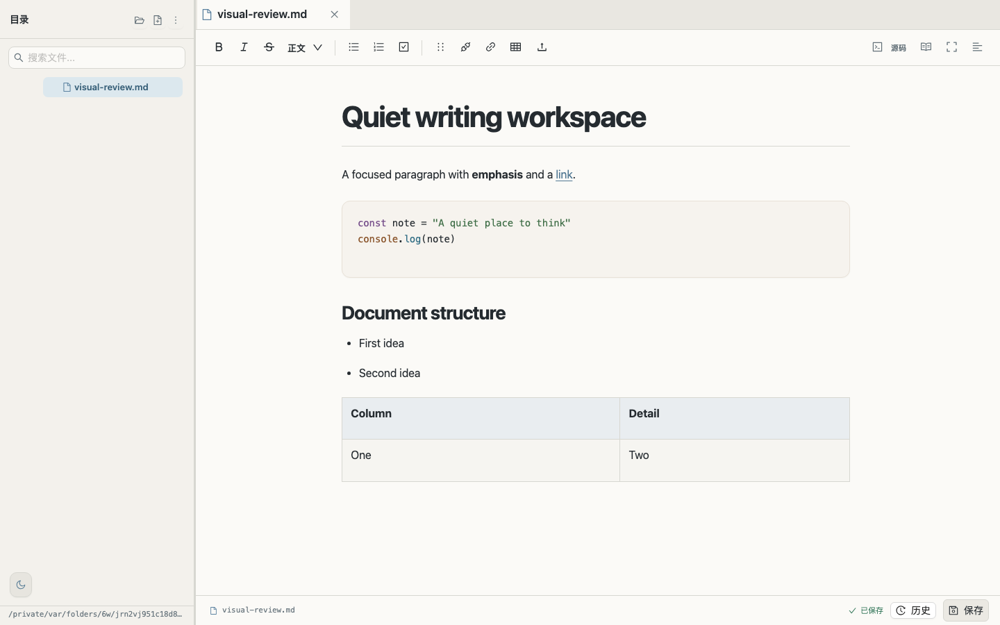
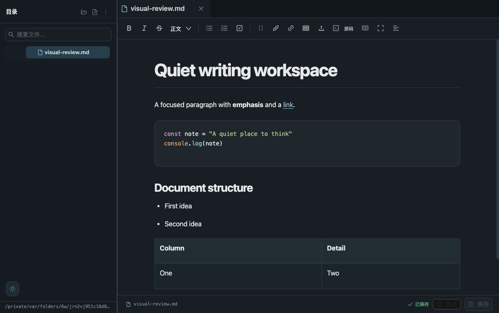
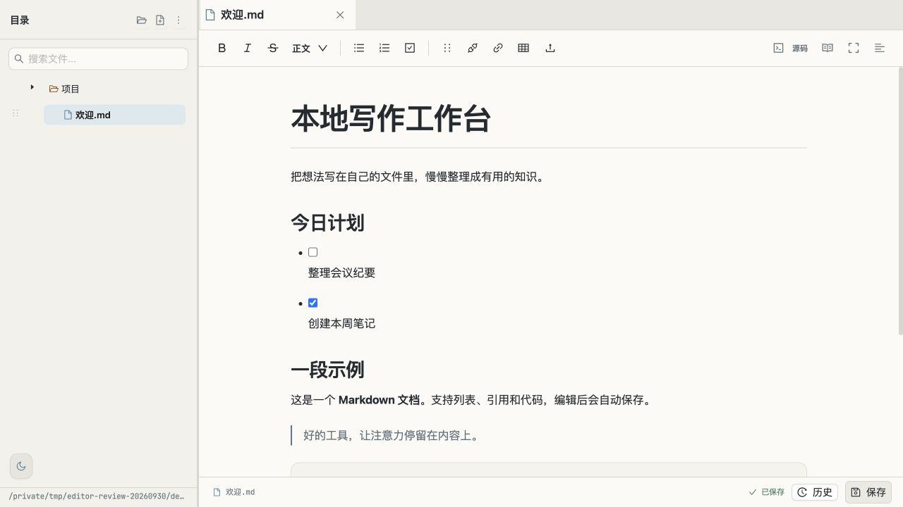
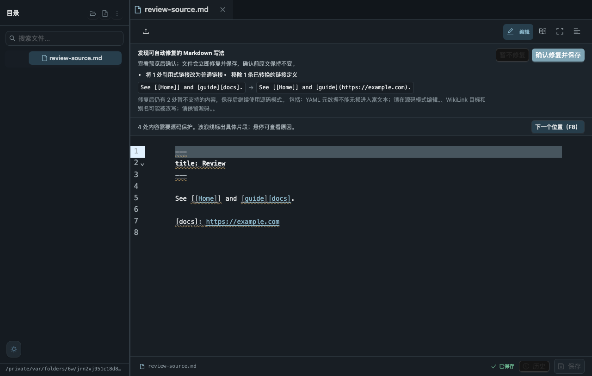
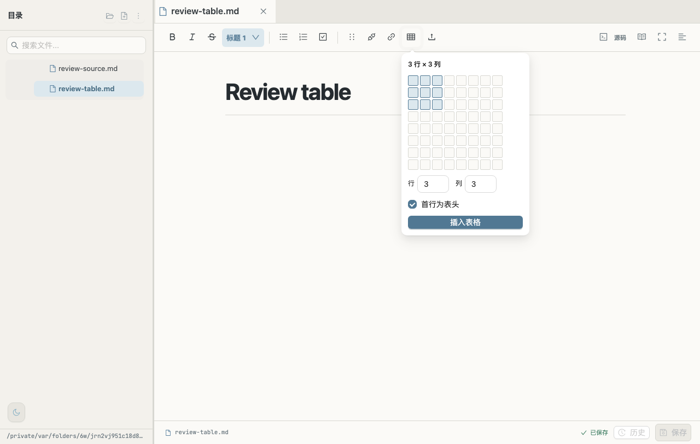

# Standalone Editor 产品级整体评审

评审日期：2026-10-01（Asia/Shanghai）
代码基准：`dc5da9dafe136649f74676613fc5a6322ce54257`，`main`，评审开始时工作树干净，本地领先 `origin/main` 一个提交。
范围：个人使用、本机或可信局域网中的 Markdown 文档工作台。所有交互、故障注入和规模试验使用隔离目录，没有操作真实笔记或更新远程服务。

## 1. 产品结论

**产品成熟度：7.5 / 10。已具备持续使用的个人文档工作台基础，适合进入有明确使用边界的候选发布阶段。**

最有价值的部分是普通 Markdown 文件、相对图片路径、自动保存与恢复机制形成了完整闭环。保存冲突、恢复草稿、历史、回收站、附件保护和工作区失效处理已有真实回归支撑。这比单纯增加编辑功能更能建立用户信任。

距离标准成熟产品，主要差在异常环境兜底、基础操作的键盘可达性、任务列表与手机操作细节，以及依赖维护和发布流程。此次未复现常规编辑路径中的静默覆盖，但这不构成所有环境下绝不丢数据的证明。

评分是基于当前定位的评审判断，不是覆盖率、行业认证或与商业编辑器直接对标的结果。公开多人服务、非可信网络访问、云同步与通用文件编辑不属于当前已验收能力。

| 维度 | 评分 /10 | 产品判断 |
|---|---:|---|
| 定位与功能闭环 | 8.5 | 文件、编辑、保存、恢复路径完整，普通目录无需迁移 |
| 数据可靠性 | 8.0 | revision 冲突保护与恢复体系扎实，仍有失败清理及持久化边界 |
| Markdown 兼容与可移植性 | 7.5 | 支持子集与源码保护形成明确边界，部分语法仍需要源码 |
| 桌面视觉与阅读 | 8.0 | 正文优先、明暗主题稳定，任务列表影响完成感 |
| 操作效率与可发现性 | 7.0 | 标签与快捷键改善，目录、菜单的键盘路径不完整 |
| 移动端与无障碍 | 6.0 | 基本查看编辑可用，触控尺寸和全流程键盘仍不足 |
| 性能与规模适应 | 6.5 | 小中型笔记库表现合理，主包较大，仍有全量扫描 |
| 测试与质量保障 | 8.0 | 覆盖真实风险场景，截图测试的状态隔离仍有缺口 |
| 架构与维护成本 | 6.5 | 技术选型合适，主组件和入口承担过多职责 |
| 部署、依赖与文档 | 6.0 | 具备运行基础，缺少清楚的发布运维闭环和持续依赖维护 |

综合分采用整体判断，不将不同性质的维度机械平均；保存与恢复的可靠性权重高于装饰性功能。

## 2. 本次验证了什么

执行环境为 macOS、Node.js `v22.22.3`。测试与截图跨 2026-09-30 至 2026-10-01，期间 HEAD 未变化；原截图与恢复后的现场审阅都对应同一份代码。

| 验证层级 | 本次结果 | 可支持的结论 |
|---|---|---|
| 后端测试 | 120 项，118 通过，2 项平台条件跳过 | 文件操作、版本、恢复、权限、导入等已覆盖场景通过 |
| 前端单元测试 | 61 / 61 通过 | Markdown 诊断、图片路径、大小与搜索协调等已覆盖逻辑通过 |
| 生产构建 | 通过，存在大包警告 | 可构建；不能单凭构建推断交互正确 |
| 浏览器功能回归 | 49 项通过 | 保存、多标签、双窗口、源码修复、图片表格等已覆盖流程通过 |
| 可选截图测试 | 与全套连续执行时 2 项超时；分别单独执行后各通过 | 发现视口状态隔离问题，不能写成“全套 51/51 绿” |
| 真实界面审阅 | 新建独立浏览器页；桌面、源码、目录选择现场检查；四尺寸和交互截图 | 发现任务列表排版与目录选择键盘缺口 |
| 依赖在线审计 | 前端 45 个受影响包记录，后端 2 个 | 已知依赖告警需分流；不等于 47 个可利用项目漏洞 |
| 临时工作区规模试验 | 2,000 个合成 Markdown 文件，三轮 | 本机小文件扫描数据，不能外推 NAS 或慢盘表现 |

完整浏览器执行时，手机图片测试将视口设为 390px 后没有恢复；后续截图测试的 `setupPage()` 又要求桌面侧栏存在，因此超时。单独复跑截图与交互项通过。依据：[测试状态设置](https://github.com/nerkeler/standalone-editor/blob/dc5da9dafe136649f74676613fc5a6322ce54257/frontend/tests/markdown-fidelity.browser.test.js#L1189)、[桌面挂载判断](https://github.com/nerkeler/standalone-editor/blob/dc5da9dafe136649f74676613fc5a6322ce54257/frontend/tests/markdown-fidelity.browser.test.js#L195)。

CI 配置已经包含 Ubuntu、Windows 后端矩阵，以及 Ubuntu 前端单元、构建和 Chrome 回归。本次没有查询远程 Actions，也没有把当前本地未推送提交描述为已通过 GitHub CI。Safari、手机真实设备、软键盘、慢网络、断电和 NAS 文件系统未进行完整验收。

## 3. 优势与产品价值

### 文件始终属于用户

文档是普通 `.md` / `.markdown`，图片保存相对路径，当前文档同级 `assets/` 可以离开本应用继续阅读。图片大小与对齐采用邻接注释保存，普通阅读器仍能显示图片；其他阅读器未必应用相同尺寸与对齐。数据库不是阅读工作区的前提。

附件可管理与下载，二进制、非法 UTF-8 和特殊文件不进入 Markdown 保存链路。大 Markdown 有 5 MiB 编辑、10 MiB 预览边界；已有测试验证只读状态不会悄悄生成自动保存。

### 数据安全从界面延伸到了后端

保存绑定文件 revision，后端修改串行化并原子替换；无变化保存不会制造多余历史。草稿有独立标签身份与定期快照，旧恢复草稿不能绕过磁盘版本比较。历史、回收站和孤儿历史都有明确入口及永久删除确认。

已保存工作区不可访问时不会静默跳到默认目录；恢复目录冲突提前校验。路径边界、符号链接、目标重名和权限失败已获得较细测试。三秒自动保存、失败保留草稿与冲突提示值得继续作为产品核心维护。

### 视觉方向已经形成

暖纸浅色、石墨深色、受约束的正文宽度和弱化的底部操作，让长期阅读有稳定节奏。代码块背景已经有轻边界与暖纸层次。标签、目录、正文、保存状态各自有清楚位置，继续精修即可。

## 4. 应优先解决的具体问题

本报告的 P1 表示应在成熟版本发布前解决的关键缺口；P2 表示可使用但影响可靠性、效率或完成感；P3 表示后续增强。本次没有确认 P0 问题。

### P1：浏览器存储不可用时，应用可能无法启动

`api.js` 对第一次缓存读取使用了 try/catch，但旧路径回退读取在 catch 外；工作区缓存写入与清理也没有兜底。实际加载模块时注入会抛异常的 `localStorage.getItem`，模块导入立即失败。`App` 依赖该模块，意味着禁用站点存储时可能无法挂载，而不是仅关闭可选草稿恢复。存储配额写满时，工作区状态更新也可能抛出异常。

依据：[缓存读取与写入](https://github.com/nerkeler/standalone-editor/blob/dc5da9dafe136649f74676613fc5a6322ce54257/frontend/src/api.js#L6)、[启动验证流程](https://github.com/nerkeler/standalone-editor/blob/dc5da9dafe136649f74676613fc5a6322ce54257/frontend/src/App.jsx#L46)、[侧栏宽度读取](https://github.com/nerkeler/standalone-editor/blob/dc5da9dafe136649f74676613fc5a6322ce54257/frontend/src/pages/Editor.jsx#L510)。读取失败已用实际模块复现；完整浏览器禁用/配额情景尚需补测试。

**验收标准：** 禁用读、禁用写、配额耗尽时仍能选择目录、打开文档和服务端保存；缓存失败不被误报为工作区不可用；草稿恢复受影响时清楚提示。

### P1：目录选择核心流程无法完整使用键盘

目录选择器子目录行是只有 `onClick` 的 DIV，没有可操作 role、焦点或键盘处理。现场 AX 将 `notes` 仅显示为图像与文字，DOM `tabIndex=-1`。键盘用户无法从入口进入子目录。文件树标题、自定义右键菜单与大纲也有相同的 click-only 模式；标签键盘导航已经实现，不能据此声称全产品支持键盘。

依据：[目录条目](https://github.com/nerkeler/standalone-editor/blob/dc5da9dafe136649f74676613fc5a6322ce54257/frontend/src/pages/Welcome.jsx#L237)、[文件树操作](https://github.com/nerkeler/standalone-editor/blob/dc5da9dafe136649f74676613fc5a6322ce54257/frontend/src/pages/Editor.jsx#L2226)、[自定义菜单](https://github.com/nerkeler/standalone-editor/blob/dc5da9dafe136649f74676613fc5a6322ce54257/frontend/src/pages/Editor.jsx#L3076)。

**验收标准：** 用 Tab、Enter、Space、方向键和 Esc 从选择工作区到打开文件、编辑、保存、重命名及关闭，全程有可见焦点，读屏能识别操作和当前状态。

### 发布前应完成依赖告警分流

前端审计：7 high、37 moderate、1 low，共 45 个受影响包记录；后端：1 moderate、1 low，共 2 个。TipTap 同一个底层告警会沿多个扩展依赖传播，包数不能当成独立漏洞数。

重点检查锁文件中的 `@tiptap/core 2.27.2`、`axios 1.15.2`、`vite 5.4.21` 和构建依赖。TipTap 官方公告说明，特定不可信属性对象进入 `mergeAttributes()` 时有风险，同时也指出固定 schema 并非自动可利用；本次未确认项目输入路径满足利用条件。[TipTap 官方公告](https://github.com/ueberdosis/tiptap/security/advisories/GHSA-cp6q-959q-f8rh)

Vite 告警包含 Windows 开发服务器的路径边界问题。这不等同于 Ubuntu 服务已经被利用，但如果把开发服务器作为长期 LAN 部署入口，其开发依赖也属于部署风险面。[Vite 官方公告](https://github.com/vitejs/vite/security/advisories/GHSA-fx2h-pf6j-xcff)

**验收标准：** 为实际部署依赖逐项记录触发条件与处置，兼容更新后重跑核心回归；跨大版本的 TipTap/Vite 更新独立实施，不直接执行未经验证的 `audit fix --force`。当前无登录按可信 LAN 定位接受，不把认证/CORS 扩建作为本轮首要任务。

### P2：保存失败会遗留隐藏临时文件

在隔离目录对最终 `rename` 注入 `EIO`：API 写入报错，原 `note.md` 保持原文，但 `.note.md.<uuid>.tmp` 仍留在目录。`temporaryStat` 声明在 try 内，catch 清理引用不到；清理错误又被忽略，因此不会删除临时副本。

依据：[临时文件创建](https://github.com/nerkeler/standalone-editor/blob/dc5da9dafe136649f74676613fc5a6322ce54257/backend/src/fileService.js#L1432)、[失败清理](https://github.com/nerkeler/standalone-editor/blob/dc5da9dafe136649f74676613fc5a6322ce54257/backend/src/fileService.js#L1484)。这次复现支持“残留副本”，不支持“原文件内容丢失”。

**验收标准：** rename、link、权限与磁盘失败时，原文件和可恢复草稿保留；只有属于本次操作的临时文件被清理；清理失败有可诊断信息。

### P2：任务列表的状态与正文排版脱节

中文样本与现场均显示圆点、复选框并存，任务文字另起一行。两个短任务占用明显过多高度，勾选状态不能和任务名快速配对。它是基础编辑能力中的完成度问题，优先级高于继续增加装饰。

**验收标准：** 去除 taskList 默认圆点；复选框与内容分列；多行、嵌套、已完成任务在两主题和手机上稳定对齐；勾选保存后重新打开状态正确。

### P2：手机触控与信息层级需要收尾

手机仍有约 34px 的相邻功能按钮、14px 的图片角柄。视觉尺寸小不等于命中区一定小，但当前代码未体现足够扩大的角柄命中区。单手操作与精细拖动需要更宽容的目标。手机工具栏隐藏后有顶部恢复入口，本轮已核对，不列为故障。

**验收标准：** 常用按钮与拖拽命中区达到舒适的移动触控尺寸；真实手机软键盘出现后，正文与保存状态仍可使用；增加尺寸不引起横向溢出。

源码保护页面同时放入修复规则、前后例子、剩余原因和定位提示，信息较密集。建议先给“为什么使用源码、能修复几处、预览并确认”，细节就地展开。波浪线表达的是富文本往返限制，不应让用户误以为合法 Markdown 本身有语法错误。引用六点图标、代码链形图标也应换成更熟悉的语义。

### P2：测试与文档还有一致性缺口

可选截图测试依赖前一个用例留下的视口，导致全套与单测结果不同。应在每个测试初始化视口，而不是将单独通过当成解决。

`docs/reference.md` 仍描述上传到根 `assets/`，实际规范流程已上传到当前文档同级；README 中“带对齐表格均受保护”也比当前支持全左对齐普通表格的实现更保守。参考文档同时出现禁止 LAN 与允许可信网络的表述，API 表遗漏工作区切换等入口。需要一次针对实际版本的核对，减少部署误导。

依据：[上传实现](https://github.com/nerkeler/standalone-editor/blob/dc5da9dafe136649f74676613fc5a6322ce54257/backend/src/index.js#L1029)、[旧参考说明](https://github.com/nerkeler/standalone-editor/blob/dc5da9dafe136649f74676613fc5a6322ce54257/docs/reference.md#L43)、[全左对齐边界](https://github.com/nerkeler/standalone-editor/blob/dc5da9dafe136649f74676613fc5a6322ce54257/frontend/src/pages/markdownDiagnostics.js#L336)。

## 5. 各能力的成熟度与限制

### Markdown 与图片表格

普通标题、段落、列表、任务、代码、图片和普通表格已具备编辑链路。编号标题、普通松散嵌套列表、全左对齐表格的误报已修复并有回归；旧报告中的同类缺陷应关闭。

复杂 YAML、WikiLinks、脚注、部分 HTML、引用链接与对齐仍采取源码保护；支持安全转换的引用/自动链接有预览、确认、revision 保护与保存。取消或只打开不会写盘。当前“受限富文本 + 完整源码”的产品策略合理，但应提供简明支持矩阵，说明支持、可规范化、必须源码各自意味着什么。

表格选择行列、插入后增删行列，以及图片大小/左中对齐和重开持久化已有浏览器验证。移动文件前已有引用影响提醒；引用修复仍主要由用户完成，不应宣传为自动维护所有内部链接。

### 文件安全与恢复

当前历史、孤儿历史、回收站、草稿恢复各自有明确职责。历史每文件最近 50 个版本、回收站记录 30 天到期但手动清理，适合个人工具，但不是跨设备备份。独立磁盘故障、站点数据清除、长期未清理的孤儿历史仍需外部备份策略。

原子替换与 revision 比较解决大多数应用内并发问题。纯 Node 路径检查到最终系统调用之间仍有竞争窗口；没有跨进程文件锁。外部删除再同名重建若未被观察，世代归属仍有限制。接受并记录这些边界即可，不建议因低频极端场景马上引入数据库身份体系。

Markdown 写入路径使用写入、关闭、rename，没有体现文件及父目录 fsync 的完整掉电持久化承诺；配置文件已同步。故障恢复不能被描述为通过断电验收。原子替换主要保留 mode，尚未完整承诺 owner/group、ACL、xattr 等元数据不变；跨账号或共享目录部署需明确。

### 外部编辑协作

切换文件会重新读取磁盘并比较草稿基准，优于长期只用内存缓存。仍缺少活动文档的文件变更通知；一直停留同一文件时，外部修改主要在下一次保存的冲突比较中暴露。不会因此直接推断静默覆盖，但用户可能先继续阅读旧内容。后续可加轻量变更提示，不自动替换未保存草稿。

### 性能

主 JS：2,091.78 kB，gzip 679.88 kB；懒加载的源码编辑器：59.03 kB，gzip 19.60 kB。桌面内网加载可接受，手机首次加载、解析与内存成本仍有改善空间。构建警告不能当成已测出的用户卡顿，下一步应测真实冷启动。

2,000 个约 5 KB 的合成文件，本机三轮 `listAll` 为 5–7ms，无匹配全文搜索为 198–225ms。它证明当前小文件 SSD 场景并不需要紧急引入索引；不代表大文档、NAS、冷缓存或 100,000 个历史版本同样快。

搜索虽有前端防抖与后端四路读取限制，仍先全量列树；工作区 `/check` 为判空也完整遍历。恢复统计仍扫描恢复目录。建议先移除不必要的启动扫描、测量真实耗时，再做增量索引或统计缓存。

### 架构

React + TipTap + Express 与个人目录工具定位相符，没有整体换框架的必要。已拆出的草稿 hook、标签、图片表格、恢复弹窗、诊断模块说明渐进拆分可行。

`Editor.jsx` 为 3,114 行，后端 `index.js` 为 1,175 行，`fileService` 同时承担安全读写、历史生命周期和搜索。成本主要来自跨 state/ref 的行为一致性，而不是行数本身。

优先抽出 Markdown codec 与文档会话边界，确保源码、富文本、草稿和磁盘 revision 的职责明确；后端把 app 创建与监听启动分开，路由逐步拆服务。保持测试约束，小步重构，每步不改行为。

### 部署与维护

后端已能提供 `frontend/dist` 静态产物，具备单进程发布基础；README 主要展示 Vite 开发启动。现有浏览器回归也主要启动 Vite，因此“构建成功 + 浏览器通过”尚未覆盖 Express 构建产物部署入口，应补一次保存、图片与下载的发布 smoke check。成熟发布需明确推荐的构建与启动方式、运行账号、日志、健康检查、数据位置、更新和回退步骤。

`start.sh` 启动阶段检查两个服务，但最后只等待后端；前端启动后退出时，脚本不会立即联动退出。应监督双方进程，或正式部署直接使用已有的静态产物方案并由服务管理器监督。

后端工作区仍是进程级全局状态；两个浏览器不能各自独立选择不同工作区。当前版本冲突会阻止写到错误工作区，这符合单人单工作区定位。若要多工作区同时使用，应另行定义产品需求。

仓库未见独立 LICENSE、CHANGELOG、SECURITY 或正式发布说明。公开发布前应补齐许可声明、版本变更与支持范围；这属于交付完整性，本报告不作法律结论。

## 6. 下一阶段建议与发布验收

| 顺序 | 工作 | 完成条件 |
|---|---|---|
| 1 | 存储异常兜底、失败临时文件清理 | 三类存储故障仍可编辑保存；写入失败不破坏原文且不遗留本次临时文件 |
| 2 | 目录/文件/菜单键盘链路与任务列表 | 键盘完成核心任务；任务状态与文字正确对齐并持久化 |
| 3 | 依赖分流及稳定部署文档 | 关键运行依赖处置有证据；构建产物部署、服务退出、更新回退可复现 |
| 4 | 手机触控、源码提示、图标语义 | 两主题、真实手机和键盘验收；合法语法不被误描述为错误 |
| 5 | 测试隔离与文档同步 | 全套带截图运行与单独运行一致；参考文档和实际行为一致 |
| 6 | 渐进拆分及性能预算 | 核心回归不变；建立冷启动/保存/搜索测量后再优化 |

下一个成熟版本的验收应固定三组数据：富文本安全样本、源码保护样本、混合附件工作区；固定桌面明暗主题、390px 手机和键盘操作；覆盖三秒保存、快速切换、多窗口冲突、写失败、恢复及存储不可用。发布验证使用临时工作区，并记录实际平台及提交。

不把 AI 写作、知识图谱、多人协作或更多主题作为当前首要项。先让已有承诺在边缘场景和常用设备上稳定兑现，产品价值会更直接。

## 7. 界面独立审阅记录

Method: dual-agent（A: `/root/review_design_resume`；B: `/root/review_evidence_resume`）。A 完成前，根代理未读取 B detector 结果。A 为设计与用户任务判断，B 为检测器与浏览器证据，自动发现需要人工核对。

| Nielsen 准则 | /4 | 主要依据 |
|---|---:|---|
| 系统状态可见 | 3 | 保存状态常驻，文字与图标共同表达 |
| 符合现实语言 | 3 | 中文主操作清楚，部分图标语义弱 |
| 用户控制与自由 | 2 | 目录选择缺键盘路径 |
| 一致性与标准 | 2 | 任务列表的状态和文字分离 |
| 错误预防 | 3 | 自动保存、源码保护、修复确认 |
| 识别优于记忆 | 2 | 手机图标和隐藏功能需要学习 |
| 灵活性与效率 | 3 | 快捷键、标签导航、搜索与专注模式 |
| 美观与简洁 | 3 | 正文优先，保护状态仍较密集 |
| 错误诊断与恢复 | 3 | 保存失败与冲突保留工作上下文 |
| 帮助与文档 | 2 | 有提示，缺易发现的完整操作帮助 |
| **合计** | **26/40** | **可接受；基础操作与可达性需改善。** |

此分数衡量操作体验，不与整体产品 7.5 分等价。熟练写作者可利用搜索与快捷键，但图标会打断操作；键盘/读屏用户在选目录时卡住；单手手机用户受紧凑目标影响。普通写作页认知负荷低，源码修复页同时要求理解较多信息，认知负荷中等。

检测器对 `Editor.jsx` 的单文件扫描退出 0，结果为 `[]`：0 条发现、无解析降级警告。它没有递归审计导入组件，也没有验证完整交互；不能因此撤销手工发现。A 与 B 独立复现了任务列表排版问题。

B 另实测表格选择器把 64 个网格按钮都放进 Tab 顺序，且 Esc 未关闭弹层，是 P2 键盘效率问题。应改为网格单个 Tab 入口、方向键选择、Tab 直达数字输入、Esc 关闭并返回触发按钮；保留可见行列与数字输入。依据：[网格按钮](https://github.com/nerkeler/standalone-editor/blob/dc5da9dafe136649f74676613fc5a6322ce54257/frontend/src/pages/TableControls.jsx#L18)。桌面“显示工具栏”恢复按钮可使用，但缺少中文 aria-label，属于 P3。

旧深色截图中底部按钮文字偏暗，经稳定主题后的实际样式核对，历史/保存对比度约 13.40:1 / 12.78:1；早期截图处于主题过渡，未确认持续低对比度问题，不列为缺陷。全页面对比度、200% 缩放与真实辅助技术尚未完整验收。

两个审阅者都使用新建独立浏览器页，并关闭了各自临时页。浏览器 evaluate 仅支持只读，未注入 overlay，未启动 detector live server；界面证据来自现有截图、现场 AX/DOM 和操作。测试服务由根代理停止，报告与截图保留供复查。

Questions skipped: 本次目标是整体评审报告，后续工作已在优先级与验收表中明确，无需额外选择题。
