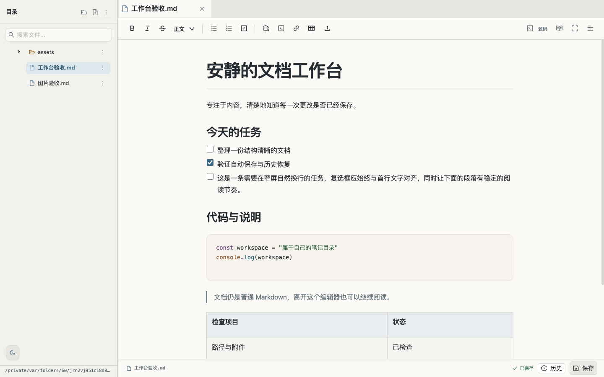
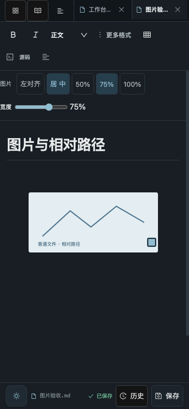
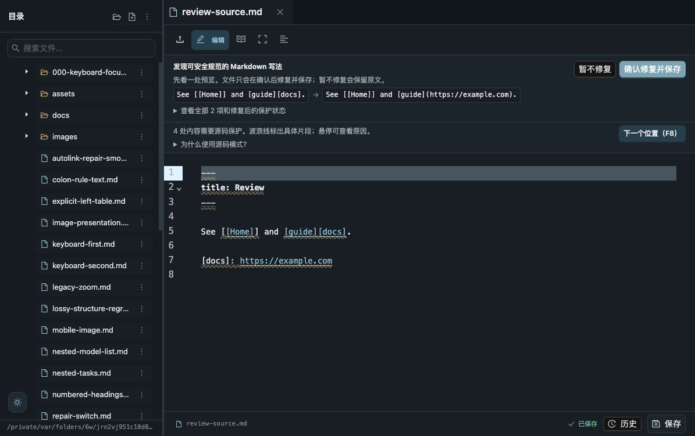
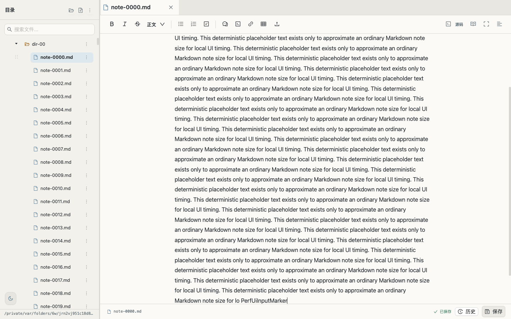

# Standalone Editor 产品化实施与验收

日期：2026-10-02（Asia/Shanghai）。基线为 `dc5da9dafe136649f74676613fc5a6322ce54257`；本报告记录其后的本地实施与验收结果。业务实施由 GPT-6 Luna（max）完成，主代理负责复审、运行回归和真实浏览器验收。

**后续 CI 核对修正：下文记录的本地验收确实通过，但 `06cd7a6` 的 GitHub Actions 三个 job 均失败，不能据此认定版本已达到可发布状态。原 9 分结论作为本地阶段判断保留，不再作为发布成熟度结论。** 已确认并修复前端 Rollup 平台锁文件缺失、ZIP 回滚误删并发修改，以及 Windows 运行时与路径断言问题；实际跨平台结果见[CI 稳定化验收](2026-10-02-ci-stabilization.md)。本地截图和交互结果不代替 Linux/Windows CI。

本轮在下述个人工作台范围内完成本地实施与验收，原综合评审为 9.0/10，各维度为 9.0–9.2。最终代码通过了下述本地后端、前端单元、完整浏览器回归和真实生产构建交互；三轮界面复审发现的问题也已修正并重新捕获。

评分是产品评审判断，不是行业认证、测试覆盖率或全部平台兼容性的证明。没有实测的设备和故障环境单独列为限制，不以评分掩盖。

## 评估范围

目标是成熟的个人 Markdown 工作台：本机或可信局域网、普通笔记目录、单个服务工作区。9 分目标按这个定位评估，不能延伸为公开多人服务、全部 Markdown 扩展无损富文本、所有设备认证或任何环境下绝不丢数据的承诺。

全部故障注入、文件操作、浏览器交互和性能测量使用临时工作区，没有编辑真实笔记，也没有更新远端服务。

## 最终检查结果

以下记录对应最终源码和生产产物。后端在其最后一次源码修改后通过；前端单元、构建、生产 smoke 和完整浏览器回归均在最后一次 FileTree 优化之后通过。没有用语法检查、构建成功或单个截图测试代替完整交互验收。

| 验证层级 | 最终结果 | 证据 |
|---|---|---|
| 后端自动化 | 132 项：130 通过、2 项平台条件跳过、0 失败 | [backend-final.txt](productization-assets/evidence/backend-final.txt) |
| 前端单元 | 75/75 通过 | [frontend-unit-verified.txt](productization-assets/evidence/frontend-unit-verified.txt) |
| 生产构建 | 通过；保留编辑器大包警告 | [build-verified.txt](productization-assets/evidence/build-verified.txt) |
| 浏览器回归 | 55/55 通过，含两类可选截图，同一轮连续执行，无跳过 | [browser-final-verified.txt](productization-assets/evidence/browser-final-verified.txt) |
| 生产部署入口交互 | 2/2 通过：Express 静态产物的保存、图片、附件；真实 lazy chunk 404 后的重载入口 | [production-verified.txt](productization-assets/evidence/production-verified.txt) |
| 额外真实交互及三轮截图复审 | 最终任务对齐、保存、键盘、尺寸和遮挡检查通过 | [acceptance.json](productization-assets/round-3/production/acceptance.json) |
| 获授权的依赖在线审计 | 前端和后端各 0 条已知告警；仅描述本次依赖树与审计时刻 | [前端](productization-assets/evidence/frontend-audit-after.json)、[后端](productization-assets/evidence/backend-audit-after.json) |

以上是本地执行结果，不是 GitHub Actions 或远端服务状态。平台条件跳过的两项后端测试没有计入通过数。复验命令和每种证据的含义见 [证据说明](productization-assets/evidence/README.md)。

## 产品复评分

沿用 [上一轮产品评审](2026-10-01-product-review.md) 的十个维度。9 分表示在本轮定义的个人工作台用途下，核心承诺与常见异常有可复验的完整流程，且没有遗留本轮已观察到的阻断；它不表示所有增强方向均已完成。

| 维度 | 原评分 | 本轮 /10 | 支持本轮判断的主要依据 |
|---|---:|---:|---|
| 定位与功能闭环 | 8.5 | 9.0 | 目录、附件边界、表格图片、三秒保存、冲突和恢复的回归闭环保留，生产入口也实际验收 |
| 数据可靠性 | 8.0 | 9.1 | 存储异常不阻断服务端保存，临时文件失败清理有身份约束，回收站跨工作区确认及迟到响应有独立测试 |
| Markdown 兼容与可移植性 | 7.5 | 9.0 | 支持子集往返及源码保护连续通过，相对图片和显示属性持久化不退化，安全修复仍需明确确认 |
| 桌面视觉与阅读 | 8.0 | 9.0 | 任务列表、图标、提示层级及明暗主题三轮复审，正文优先的暖纸方向稳定 |
| 操作效率与可发现性 | 7.0 | 9.0 | 目录、文件树、菜单、大纲和表格可键盘操作，取消与焦点返回实测，表格不再产生 64 个 Tab 停靠点 |
| 移动端与键盘可达性 | 6.0 | 9.0 | 390/768px 与布局等效视口通过，指定常用目标及图片命中区至少 44px，主题不遮挡正文；评分限已测的响应式和键盘路径 |
| 性能与规模适应 | 6.5 | 9.0 | 3,000 小笔记真实生产界面三轮测量，输入中位数 429→18ms，打开正文 963→417ms；每轮验证真实保存 |
| 测试与质量保障 | 8.0 | 9.2 | 完整带截图回归连续通过，补充生产入口、依赖迁移、存储故障和服务生命周期测试，保留实际失败与修复记录 |
| 架构与维护成本 | 6.5 | 9.0 | codec、UI、恢复协调及存储职责拆出，后端创建与监听分离且实例隔离可测试；大树 memo 的最新回调另经独立审查 |
| 部署、依赖与文档 | 6.0 | 9.0 | 生产启动、健康与退出可复验，当前依赖告警清零，运行账号、备份、升级和回退说明同步 |

综合 9.0 是整体判断，不机械平均。性能和维护性由独立审阅者再次核对构建哈希、三轮数据及最新回调边界，支持当前个人本机范围内的 9 分判断。移动端一栏没有声称真实手机触摸、软键盘或读屏全流程达到相同评分；这些仍待专项实测。

## 已落地的改进

| 原问题 | 实施与验证目标 |
|---|---|
| 浏览器存储被禁用或写满时会阻断应用 | `safeStorage` 统一捕获读、写、删除、枚举和 JSON 异常；API 身份优先留在内存；草稿缓存失败明确提示，服务端三秒保存继续 |
| 写入失败留下隐藏临时文件 | 临时文件身份在失败路径仍可访问；只删除本次拥有的 inode，保留外来替换；发布前同步文件内容，清理失败可诊断 |
| 回收站操作的确认和迟到响应跨工作区更新 | 恢复协调器绑定工作区 ID、版本、epoch 和挂载状态；确认框打开前捕获意图；卸载、切换或异步返回后再次核验；Axios 保留显式身份头 |
| 目录、文件树、菜单、大纲依赖点击 | 原生按钮、文件树键盘导航、F2 重命名、Shift+F10 菜单、Escape 焦点返回；目录 Enter 浏览及确认 |
| 表格网格产生 64 个 Tab 停靠点 | 单个 roving Tab 停靠点，方向键选择行列，Escape 关闭并返回触发按钮 |
| 任务复选框、圆点、正文错位 | taskList 无圆点、taskItem 两列布局；适配 TipTap 实际 NodeView 属性；中文换行与勾选保存重开验收 |
| 手机小按钮和图片角柄难以操作 | 主工具、图片操作和角柄扩大命中区；窄屏主题按钮进入底部状态栏槽位，避免遮挡正文 |
| 主组件职责混杂 | 提取 Markdown codec、文件树、工具栏、大纲、菜单及恢复协调层；保留草稿会话边界和现有 revision 保存路径 |
| 大库展开后正文输入明显延迟 | 实测后给 FileTree 增加真实 memo 边界，稳定选中数组和目录数据；交互代理在每次 commit 后同步最新回调，避免旧重命名内容或选中状态 |
| 后端导入会直接启动进程 | `createBackend` 无监听副作用，各实例拥有自己的配置、恢复目录、队列和工作区；监听与退出处理独立 |
| 发布构建缺少真实验收 | 新增仅启动 Express 的生产 smoke：实际编辑保存、相对图片、附件原始字节；独立模拟 lazy Editor chunk 404，验证可重载错误入口 |
| 依赖告警及外部样式依赖 | 同步迁移 TipTap 3、Vite 7、Axios 等依赖并更新锁文件；移除 CDN 字体及样式，使用本地资源与系统字体 |
| 截图测试依赖之前遗留视口 | 每次 setup 重置桌面视口；整套同时启用两类可选截图，不用“单独通过”代替连续通过 |

升级期间真实验收先后发现漏导入的工具图标、taskItem 样式匹配问题、React StrictMode 下过早读取 TipTap view。它们均被作为失败处理，再交 Luna 修复。交互和图片粘贴监听改由 ProseMirror DOM events 管理，保留 StrictMode。

## 三轮界面复审

第一轮发现工作台挂载失败和任务列表错位。第二轮独立生产界面验证了表格、文件树、目录键盘流程与中文任务保存；独立截图审阅还发现主题按钮覆盖窄屏正文。第三轮使用修正后的生产产物重新捕获，实际检查了明暗主题、390px 手机、768px 平板、720×450 布局等效视口及图片操作。

第三轮也先发现一个顶部按钮仍被内联样式限制为 34px，交 Luna 修正后重新构建和捕获。最终量测：指定的常用移动按钮与图片操作按钮至少 44×44px；图片角柄 44×44px；390px 页宽与滚动宽均为 390px；手机和布局等效视口中的主题按钮不与正文相交。任务框与首行的垂直差约 2.56px，没有任务圆点；真实勾选已等待三秒落盘。健康交互路径的浏览器运行时异常计数为 0。

表格网格只有一个 Tab 停靠点，方向键实际到达“2 行 2 列”；Escape 返回插入按钮。文件树实际验证 F2 取消不重命名、Shift+F10 打开菜单和 Escape 返回树输入；目录条目使用 Enter 进入子目录、返回并确认。原始量测见 [acceptance.json](productization-assets/round-3/production/acceptance.json)。

主代理实际查看了最终截图；独立审阅者再次查看手机、图片、平板和布局等效截图，确认第二轮的主题遮挡已消失，邻近文件名与保存操作没有碰撞。这里的 44px 结论限定于记录中的按钮及角柄，不是对产品所有交互目标的笼统认证。

源码保护提示将可修复预览与无法转换的原因分层展示，细节可展开，确认按钮仍明确“修复并保存”。保护波浪线表示往返兼容限制，合法语法不会被标成语法错误。

这里的 720×450 截图是 1440×900 在 200% 时的 CSS 布局等效检查，不能写成真实浏览器缩放或真机测试。390px 与 768px 使用 Chrome 视口模拟。

## 性能与包体的实际边界

3,000 个合成笔记、60 个目录、每篇约 2,848 字节，本机 SSD 上各请求重复五次：

| 请求 | 中位耗时 |
|---|---:|
| 工作区检查 | 1.22 ms |
| 完整文件树（3,000 个文件） | 9.53 ms |
| 文件名搜索（100 条结果） | 7.19 ms |
| 内容搜索（100 条结果） | 16.54 ms |
| 无命中全文扫描 | 269.58 ms |

原始记录在 [performance.json](productization-assets/evidence/performance.json)。这些是本机、重复请求、暖文件缓存的数据，不代表 NAS、慢盘或十万文档。启动判空已改为找到首个可用文件便返回；没有为了评分引入复杂数据库或索引。

入口 JS 从约 2,092 kB 拆为约 589 kB，Editor 按需加载约 1,597 kB，源码编辑器约 59 kB。这改善目录选择入口的解析负担，**不意味着打开完整工作台只下载 589 kB**。完整编辑器仍有大包警告；构建日志里的 gzip 数字也不证明 Express 已提供 gzip 传输。小型验收工作区在新 Chrome profile 中进入可交互工作台为 220ms；它不是 3,000 篇笔记的冷加载结果。

另做生产构建的完整界面测量：3,000 篇、60 个目录、每篇恰好 2,848 字节的英文合成笔记，1440×900 headless Chrome。优化前后各三个独立 profile，禁用浏览器 HTTP 缓存；不控制系统文件缓存。测量不与其他测试并行，耗时包含 CDP 通信和观察轮询。

| 界面步骤（中位数） | 优化前 | 最终优化后 |
|---|---:|---:|
| 导航到初始目录树可交互 | 178 ms | 173 ms |
| 全部展开至实际 3,000 文件 + 60 目录节点 | 543 ms | 481 ms |
| 点击笔记至可编辑正文 | 963 ms | 417 ms |
| 正文输入至下一帧可观察到文字 | 429 ms | 18 ms |
| 输入至磁盘出现保存内容 | 3,059 ms | 3,061 ms |

429ms 输入延迟是在验收中真实发现的问题，修复后没有用保存速度或 API 速度代替输入响应。最终三轮的输入值为 18/25/18ms，三轮均观察到 PUT 200、磁盘实际内容、页脚“已保存”，没有运行时或控制台错误。普通输入不再带动整个目录树渲染；选择、重命名、移动与目录变化仍会正常更新。独立代码复审确认稳定代理在 commit 后读取最新回调，未用忽略 callback 的比较器掩盖旧闭包。

原始数据：[优化前](productization-assets/evidence/large-workspace-ui-before.json)、[优化后](productization-assets/evidence/large-workspace-ui.json)。早期滚动子项错误地使用 rAF 帧起点作回调时间，已在优化前记录中标为无效，不用于结论；最终脚本在 callback 内读取实际时间。输入匹配也曾因 Markdown 下划线转义造成测试误判，改为纯字母探针并验证真实落盘后再记录，没有把这个脚本问题描述为业务保存失败。

## 尚不能宣称已验证的能力

- 真实手机触摸、软键盘、VoiceOver/NVDA、Windows/NAS 文件系统与突然掉电没有在本轮实际运行。CI 中的 Windows 后端矩阵只是配置，不能代替本次远程运行结果。
- 无登录仍符合可信网络的个人使用边界，不将工作区 ID 或 revision 当认证。
- 文件内容 fsync 不等于父目录元数据的掉电持久化；也没有新增跨进程文件锁或完整 ACL/xattr 保留承诺。
- 复杂 Markdown 继续采用源码保护。只有安全转换候选可经用户预览确认、revision 校验后保存；打开受保护文档不会偷偷规范化原文。
- 搜索和恢复统计仍有扫描路径，Editor 主组件仍需承担工作台编排。当前拆分改善职责边界，不表示所有架构债务已经消失。
- 本轮只修改本地源码、测试与文档；没有把这些改动描述成 GitHub Actions 已通过或远端服务已更新。

运行与维护见 [release-runtime.md](../release-runtime.md)，依赖更新过程见 [dependency-maintenance.md](../dependency-maintenance.md)。本轮实施和本地验收已完成，源码、测试、日志及最终截图一起归档。验收未更新远端运行服务；后续发布状态以 Git 提交和部署记录为准。
